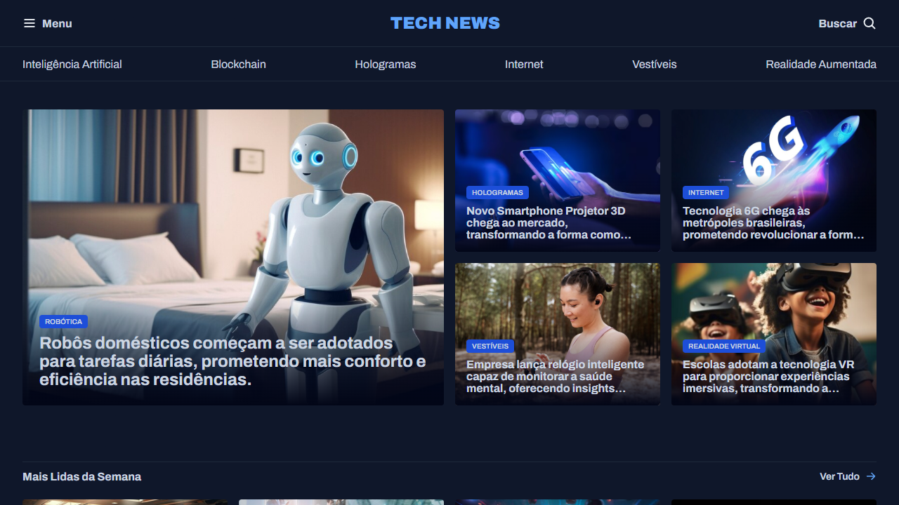
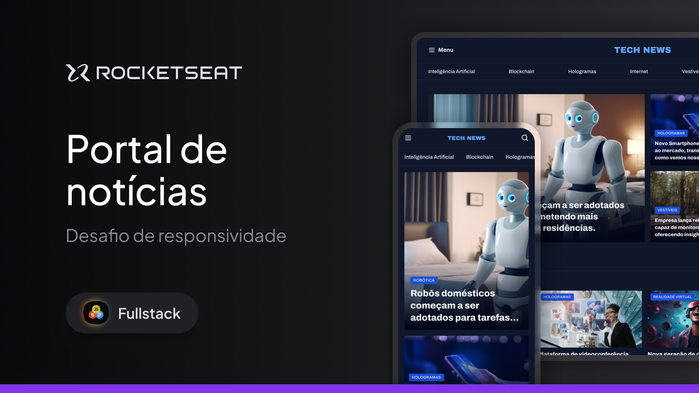

<h1 align="center">
  
</h1>

<div align="center">
  <a href="#📸-visão-do-projeto--project-view">📸 Visão do Projeto | Project View</a> -
  <a href="#ℹ-sobre-o-projeto--about-the-project">ℹ Sobre o Projeto | About the Project</a> -
  <a href="#🏗-principais-funcionalidades--main-features">🏗 Principais Funcionalidades | Main Features</a> -
  <a href="#⚙️-tecnologias--technologies">⚙️ Tecnologias | Technologies</a> -
  <a href="#🧪-testar-o-projeto---clique-no-botão--test-the-project---click-on-the-button">🧪 Testar o Projeto - Clique no botão | Test the Project - Click on the button</a> -
  <a href="#🎨-layout---clique-na-miniatura--layout---click-on-the-thumbnail">🎨 Layout - Clique na miniatura | Layout - Click on the thumbnail</a> -
  <a href="#💻-clonagem-do-repositório--repository-cloning">💻 Clonagem do Repositório | Repository Cloning</a> -
  <a href="#🤝-contribuições--contributions">🤝 Contribuições | Contributions</a> -
  <a href="#👨‍💻-autor--author">👨‍💻 Autor | Author</a>
</div>

## 📸 Visão do Projeto | Project View

<div align="center">
  
  

</div>

## ℹ Sobre o Projeto | About the Project

### 🌐 Português

Durante minha jornada de aprendizado em desenvolvimento web com a Rocketseat, me deparei com o desafio de desenvolver uma landing page de notícias tecnológicas, utilizando apenas HTML e CSS. A proposta do curso era aplicar, na prática, os conceitos fundamentais de estruturação semântica, organização visual e boas práticas de estilização. O objetivo era construir uma interface moderna, responsiva e visualmente atraente, sem o uso de frameworks, focando totalmente na base do front-end.

Para isso, criei a estrutura da página com HTML bem segmentado, dividindo seções como cabeçalho, hero, destaques de IA, notícias mais lidas e anúncios recomendados. No CSS, adotei uma abordagem modular, separando estilos em arquivos específicos como header.css, hero.css, most-read.css, entre outros, garantindo clareza e facilidade de manutenção. Centralizei a identidade visual no global.css, com uso de variáveis para cores e fonte, promovendo consistência e escalabilidade no design. Apliquei técnicas modernas como display: grid e flexbox para estruturar os layouts, adicionei transições com hover, efeitos visuais sutis, truncamento de texto com line-clamp, e organização de imagens com object-fit.

O resultado foi uma página fluida, bem organizada e com um visual elegante, que reflete os ensinamentos do curso de forma prática. Esse projeto me permitiu consolidar conhecimentos essenciais sobre HTML e CSS, entender melhor a importância da componentização visual e fortalecer minha capacidade de estruturar um layout responsivo e escalável do zero. Além disso, serviu como uma excelente base para projetos mais avançados, reforçando minha evolução como desenvolvedor.

### 🌐 English

During my learning journey in web development with Rocketseat, I faced the challenge of building a tech news landing page using only HTML and CSS. The course project aimed to put into practice the fundamental concepts of semantic structure, visual organization, and styling best practices. The goal was to create a modern, responsive, and visually appealing interface without relying on frameworks—focusing entirely on the front-end foundations.

To achieve this, I built the page structure with well-segmented HTML, dividing sections such as header, hero, AI highlights, most-read news, and recommended ads. In CSS, I adopted a modular approach, splitting styles into specific files like `header.css`, `hero.css`, `most-read.css`, among others, ensuring clarity and ease of maintenance. I centralized the visual identity in `global.css`, using variables for colors and typography to promote consistency and design scalability. I applied modern techniques like `display: grid` and `flexbox` for layout structure, added transitions with `hover` effects, subtle visual animations, text truncation with `line-clamp`, and clean image handling using `object-fit`.

The result was a smooth, well-organized page with a sleek look that reflects the course teachings in a practical way. This project helped me solidify essential knowledge of HTML and CSS, better understand the importance of visual componentization, and strengthen my ability to build responsive and scalable layouts from scratch. It also served as a strong foundation for more advanced projects, reinforcing my growth as a developer.

## 🏗 Principais Funcionalidades | Main Features

### 🌐 Português

- [x] **Layout responsivo e modularizado:** Estrutura construída com CSS Grid e Flexbox, adaptando-se a diferentes tamanhos de tela e garantindo boa experiência em diversos dispositivos.

- [x] **Design visual consistente com variáveis CSS:** Paleta de cores unificada e centralizada no `:root`, facilitando alterações e mantendo identidade visual clara.

- [x] **Cartões de conteúdo interativos:** Cards com imagem, tag e título estilizados com efeitos `:hover`, proporcionando uma interface dinâmica e envolvente.

- [x] **Truncamento inteligente de textos:** Implementação de `line-clamp` via CSS (`truncate.css`) para limitar o número de linhas exibidas, evitando que conteúdos longos quebrem o layout.

- [x] **Componentização visual com CSS modular:** Estilização separada por responsabilidade (`hero.css`, `most-read.css`, `card-img.css`, etc.), otimizando a escalabilidade e reutilização de estilos.

- [x] **Cabeçalho funcional com navegação estilizada:** Inclusão de menu, botão de busca e ícone de logo com feedback visual ao passar o mouse, promovendo melhor usabilidade.

### 🌐 English

- [x] **Responsive and modular layout:** Structure built with CSS Grid and Flexbox, adapting to different screen sizes and ensuring a good experience across devices.

- [x] **Consistent visual design with CSS variables:** Unified color palette defined in `:root`, making updates easier and maintaining a clear visual identity.

- [x] **Interactive content cards:** Cards with images, tags, and titles styled with `:hover` effects, creating a dynamic and engaging user interface.

- [x] **Smart text truncation:** Use of `line-clamp` via CSS (`truncate.css`) to limit the number of visible text lines, keeping the layout clean and balanced.

- [x] **Visual componentization with modular CSS:** Styles separated by responsibility (`hero.css`, `most-read.css`, `card-img.css`, etc.), improving scalability and code reuse.

- [x] **Functional header with styled navigation:** Menu, search button, and logo icon with visual feedback on hover, enhancing usability.

## ⚙️ Tecnologias | Technologies

- <a href="https://www.w3schools.com/html/default.asp"> HTML</a>
- <a href="https://www.w3schools.com/css/"> CSS</a>

## 🧪 Testar o Projeto - Clique no botão | Test the Project - Click on the button

<a href="https://henry-frrz.github.io/tech-news/">
  
</a>

## 🎨 Layout - Clique na miniatura | Layout - Click on the thumbnail

<a align="center" href="https://www.figma.com/community/file/1362166020452569562/portal-de-noticias">
  
</a>

## 💻 Clonagem do Repositório | Repository Cloning

### 🌐 Português

1. **Requisitos:** Você precisa apenas de um navegador para executar este projeto.

2. **Baixar o Projeto:** Clique no botão **Code** e selecione **Download ZIP**, depois extraia os arquivos no local desejado. Alternativamente, você pode clonar o repositório usando Git:

```bash
git clone https://github.com/henry-frrz/tech-news.git
```

3. **Abrir o Projeto:** Localize os arquivos extraídos ou clonados e abra o arquivo `index.html` no seu navegador.

### 🌐 English

1. **Requirements:** You only need a web browser to run this project.

2. **Download the Project:** Click on the **Code** button and select **Download ZIP**, then extract the files to your preferred location. Alternatively, you can clone the repository using Git:

```bash
git clone https://github.com/henry-frrz/tech-news.git
```

3. **Open the Project:** Locate the extracted or cloned files and open the index.html file in your browser.

## 🤝 Contribuições | Contributions

### 🌐 Português

Se você deseja contribuir para o projeto, siga as diretrizes abaixo:

1. Faça um fork do repositório no GitHub.

2. Crie uma nova branch para sua contribuição:

```bash
git checkout -b feature/sua-contribuicao
```

3. Faça as alterações necessárias e teste para garantir que as mudanças sejam robustas e confiáveis.

4. Envie suas alterações com um pull request (PR).

5. Após revisão e aprovação, suas alterações serão incorporadas ao projeto.

### 🌐 English

If you would like to contribute to the project, please follow the contribution guidelines below:

1. Fork the repository on GitHub.

2. Create a new branch for your contribution:

```bash
git checkout -b feature/your-contribution
```

3. Make any necessary changes, and test them to ensure that the changes are robust and reliable.

4. Submit your changes with a pull request (PR).

5. After review and approval, your changes will be incorporated into the project.

## 👨‍💻 Autor | Author

<a href="https://github.com/henry-frrz">

</a>
<br>
