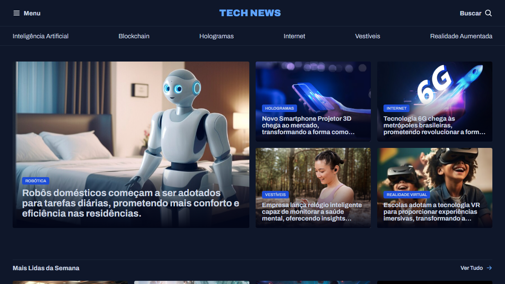
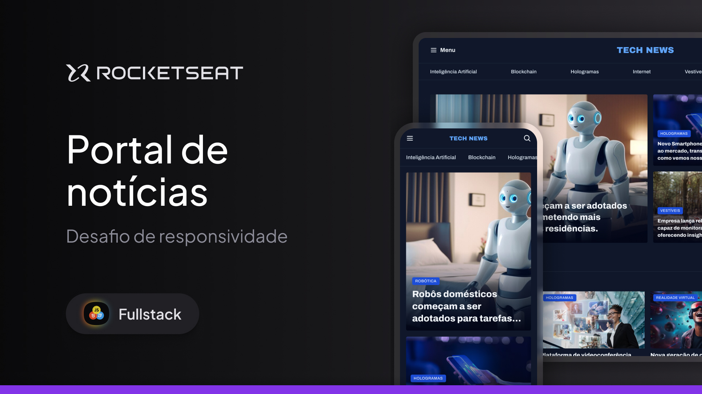

<h1 align="center">
  
</h1>

<div align="center">
  <a href="#📸-project-view">📸 Project View</a> -
  <a href="#ℹ-about-the-project">ℹ About the Project</a> -
  <a href="#🏗-main-features">🏗 Main Features</a> -
  <a href="#⚙️-technologies">⚙️ Technologies</a> -
  <a href="#🧪-test-the-project---click-on-the-button">🧪 Test the Project</a> -
  <a href="#🎨-layout---click-on-the-thumbnail">🎨 Layout</a> -
  <a href="#💻-repository-cloning">💻 Repository Cloning</a> -
  <a href="#🤝-contributions">🤝 Contributions</a> -
  <a href="#👨‍💻-author">👨‍💻 Author</a>
</div>

## 📸 Project View

<div align="center">
  
  
</div>

## ℹ About the Project

<p>
  As part of my course, I was tasked with developing a mockup of a technology news website using a pre-designed layout. The goal was to structure and style the page with HTML and CSS to ensure it was visually appealing, well-organized, and interactive.

  I implemented the provided design using semantic HTML and CSS, applying Flexbox and CSS Grid for layout, and animations and hover effects for interactivity. I also managed text overflow to keep the design clean and functional.

  The final result was a polished, interactive, and visually consistent news website, strengthening my skills in Flexbox, Grid, animations, and CSS best practices.
</p>

## 🏗 Main Features

- [x] **Structured Layout:** Implemented using **Flexbox** and **CSS Grid** to create an organized and responsive design.

- [x] **Hover Animations:** Applied smooth transitions and hover effects to enhance user experience when interacting with news cards.

- [x] **Text Overflow Effect:** Used the `text-overflow: ellipsis;` and other CSS techniques to add a dotted ending when the text exceeds the defined space, ensuring a clean appearance.

- [x] **Consistent Stylization:** Applied uniform styles across different sections, ensuring visual harmony through typography, colors, and spacing.

- [x] **Modular Styling:** Used efficient CSS techniques to maintain a scalable and easily adjustable design.

## ⚙️ Technologies

- <a href="https://www.w3schools.com/html/default.asp"> HTML</a>
- <a href="https://www.w3schools.com/css/"> CSS</a>

## 🧪 Test the Project - Click on the button

<a href="https://henry-frrz.github.io/tech-news/">
  
</a>

## 🎨 Layout - Click on the thumbnail

<a align="center" href="https://www.figma.com/community/file/1392188698846698895">
  
</a>

## 💻 Repository Cloning

1. **Requirements:** You only need a web browser to run this project.

2. **Download the Project:** Click on the **Code** button and select **Download ZIP**, then extract the files to your preferred location. Alternatively, you can clone the repository using Git:

```bash
git clone https://github.com/henry-frrz/tech-news.git
```

3. **Open the Project:** Locate the extracted or cloned files and open the index.html file in your browser.

## 🤝 Contributions

If you would like to contribute to the project, please follow the contribution guidelines below:

1. Fork the repository on GitHub.

2. Create a new branch for your contribution:

```bash
git checkout -b feature/your-contribution
```

3. Make any necessary changes, and test them to ensure that the changes are robust and reliable.

4. Submit your changes with a pull request (PR).

5. After review and approval, your changes will be incorporated into the project.

## 👨‍💻 Author

<a href="https://github.com/henry-frrz">

</a>
<br>

🌌 Building connections across the code universe, Henrique Ferraz 🚀
